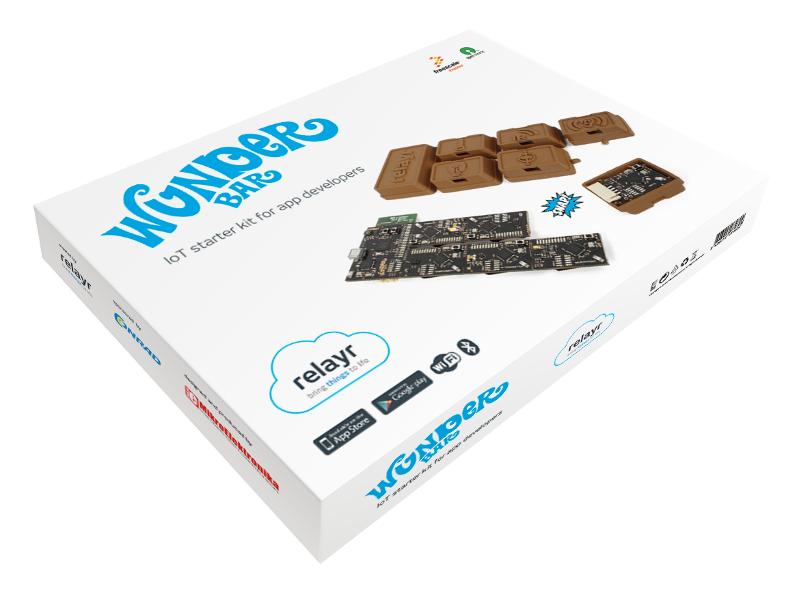

WunderBar Hardware
------------

Welcome to the **WunderBar Hardware Schematics and Layout**.
This repository contains the latest version of the *WunderBar* hardware design.

The *WunderBar* is actually being manufactured by *MikroElektronika* (http://www.mikroe.com/wunderbar/). However, if you want to make your own custom version, we encourage you to share, modify, extend and improve the actual design!! Therefore here is all you need to manufacture your own version:

### Datasheets:
In the *"/Datasheets"* folder you will find the relevant ICs datasheets of the MCUs, sensors and extra circuitery separated by module.
### Schematics:
The complete project for Altium Designer TM: http://www.altium.com/altium-designer/overview is located in the *"AltiumDesignerProject"* folder.

For a quick look into the schematics for the Master Module and the 6 BLE modules, check the file *"WunderBar Schematics v1_3.pdf"*.

### Layout:
A PDF output of the PCB Layout is in *"Wunderbat Layout.pdf"*. For a detailed view of the different layers and connections open the *Altium* project.

### Bill of Materials:
The *"Bill of Materials v1_3"* sheet details the components names, quantity, supplier name and part numbers. There are also two files inside *"/Manufacturing/BillOfMaterials"* wich relates the components to the actual designator code on the Schematics and Layout.

### Gerber Files:
The Gerber files output and Pick and Place configuration files are located inside the *"/Manufacturing"* folder.

#### To get all the files:
* Download the repository as a **.zip** file from [here](https://github.com/relayr/wunderbar-hardware/archive/master.zip).

or

* If you have **git** installed just go to folder where you want to download it and do:

	`git clone https://github.com/relayr/wunderbar-hardware.git`

We hope that you'd utilize the Wunderbar in your future projects. The realm of possibilities is as vast as your imagination!!!
### License:

We are using the **MIT License (MIT)**:

Copyright (c) 2014 relayr.io

Permission is hereby granted, free of charge, to any person obtaining a copy of this hardware, software, and associated documentation files (the "Product"), to deal in the Product without restriction, including without limitation the rights to use, copy, modify, merge, publish, distribute, sublicense, and/or sell copies of the Product, and to permit persons to whom the Product is furnished to do so, subject to the following conditions:

The above copyright notice and this permission notice shall be included in all copies or substantial portions of the Product.

THE PRODUCT IS PROVIDED "AS IS", WITHOUT WARRANTY OF ANY KIND, EXPRESS OR IMPLIED, INCLUDING BUT NOT LIMITED TO THE WARRANTIES OF MERCHANTABILITY, FITNESS FOR A PARTICULAR PURPOSE AND NONINFRINGEMENT. IN NO EVENT SHALL THE AUTHORS OR COPYRIGHT HOLDERS BE LIABLE FOR ANY CLAIM, DAMAGES OR OTHER LIABILITY, WHETHER IN AN ACTION OF CONTRACT, TORT OR OTHERWISE, ARISING FROM, OUT OF OR IN CONNECTION WITH THE PRODUCT OR THE USE OR OTHER DEALINGS IN THE PRODUCT.

### relayr.io
